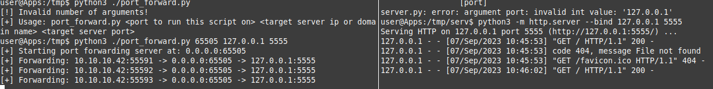

# python_port_forward
Port forwarding script written in Python 3 and sockets library

## How it works
For example we have our machine "A", server, where this script is running "S" and target, where we can not connect to directly "R"
When client "A" connects to the server "S", server "S" establishing a connection to remote server "R" and start the infinite loop
where server "S" recieves data from "A" and directing this data to "R" and vice versa.

## Usage
1. Clone this repository to the server where you want to run a port forwarding  
2. Change directory to the project: `cd python_port_forward`  
3. Run port forwarding server: `python3 ./port_forward.py <local_port> <remote_host> <remote_port>` for example `python3 ./port_forward.py 9010 127.0.0.1 8081`

## Example
Let's say I have a server that my machine have access to, but server runs a web application on it's `localhost` and port `5555` so we can not access this application  
Also this port blocked by UFW rule, but port `65505` is open and we can run this port forwarding script on it like shown in Fig. 1  
  
After we run the port forwarding server we can connect to the ip address or domain name and port to that, in my case `10.10.10.209:65505`  
Connection successful and we got the result, index page from webserver that running locally  

This script works on most of protocols which is above Session layer of OSI model